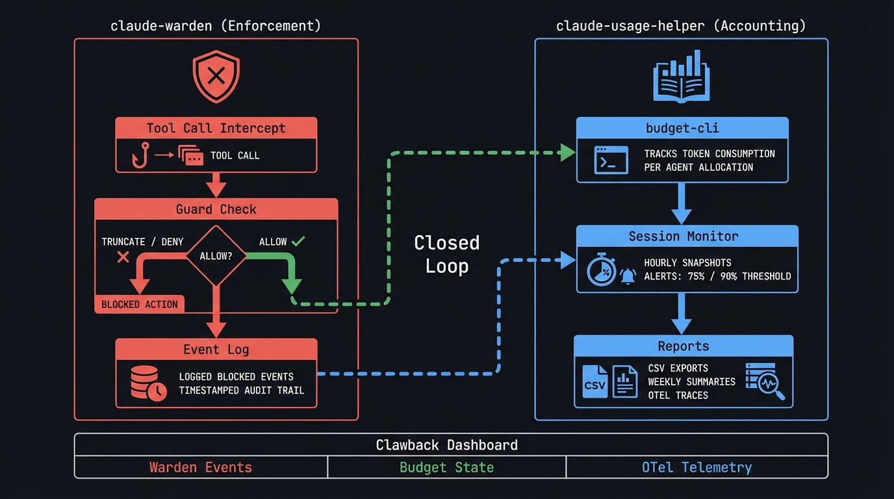

# claude-warden

Token-saving hooks for [Claude Code](https://docs.anthropic.com/en/docs/claude-code). Prevents verbose output, blocks binary reads, enforces subagent budgets, truncates large outputs, and provides a rich statusline -- saving thousands of tokens per session.

Pair with [claude-usage-helper](https://github.com/johnzfitch/claude-usage-helper) for budget tracking, cost telemetry, and session analytics. Warden enforces; usage-helper accounts.

## Quickstart

1. Install prerequisites: `jq` (required). Optional: `rg`, `fd`, `budget-cli`.
2. Install hooks into `~/.claude/` (symlink mode):
   ```bash
   ./install.sh
   ```
3. Start a new Claude Code session. Hooks will run automatically.

Dry-run (no changes to `~/.claude/`):

```bash
./install.sh --dry-run
```

## Architecture

<picture>
  <source media="(prefers-color-scheme: dark)" srcset="assets/architecture-dark.png">
  <source media="(prefers-color-scheme: light)" srcset="assets/architecture-light.png">
  
</picture>

## What it does

claude-warden installs a set of shell hooks that intercept Claude Code tool calls at every stage of execution. Each hook enforces token-efficient patterns and blocks common waste.

### Guard catalog

| Hook | Event | What it guards |
|---|---|---|
| `pre-tool-use` | PreToolUse | Blocks verbose commands (`npm install` without `--silent`, `cargo build` without `-q`, `pip install` without `-q`, `curl` without `-s`, `wget` without `-q`, `docker build/pull` without `-q`). Blocks binary file reads. Enforces subagent tool budgets. Blocks recursive grep/find without limits. Blocks Write >100KB, Edit >50KB. Blocks minified file access. |
| `post-tool-use` | PostToolUse | Strips `<system-reminder>` blocks from all tool results. Compresses Task/agent output >6KB to structured lines (bullets, headers, tables). Truncates Bash output >20KB to 10KB (8KB head + 2KB tail). Suppresses output >500KB entirely. Detects binary output. Tracks session stats. Budget alerts at 75%/90%. |
| `read-guard` | PreToolUse (Read) | Blocks Read on bundled/generated files (`node_modules/`, `/dist/`, `.min.js`, etc.). Blocks files >2MB. Reports blocked reads to events.jsonl. |
| `read-compress` | PostToolUse (Read) | Strips `<system-reminder>` blocks from Read results. Extracts structural signatures (imports, functions, classes) from large file reads. Subagents: >100 lines. Main agent: >500 lines. Reports compression savings to events.jsonl. |
| `permission-request` | PermissionRequest | Auto-denies dangerous commands (`rm -rf /`, `mkfs`, `curl \| bash`). Auto-allows safe read-only commands. |
| `stop` | Stop | Logs session stop events with duration. |
| `session-start` | SessionStart | Initializes session timing and budget snapshots. |
| `session-end` | SessionEnd | Logs session duration, budget delta, subagent counts. |
| `subagent-start` | SubagentStart | Enforces budget-cli limits. Tracks active subagent count. Injects type-specific guidance with output budgets (max token counts, format constraints). |
| `subagent-stop` | SubagentStop | Reclaims budget. Logs subagent metrics (duration, type). |
| `tool-error` | ToolError | Logs errors with context. Provides recovery hints. |
| `statusline.sh` | StatusLine | Displays model, context %, IO tokens, cache stats, tool count, hottest output, active subagents, budget utilization. |

### Hook lifecycle

```
PreToolUse ──> [tool executes] ──> PostToolUse
     │                                  │
     ├─ pre-tool-use (all tools)        ├─ post-tool-use (all tools)
     └─ read-guard (Read only)          └─ read-compress (Read only)
```

## Requirements

- **Required**: `jq` (JSON processing)
- **Recommended**: `rg` (ripgrep), `fd` (fd-find)
- **Optional**: `budget-cli` (token budget tracking -- from [claude-usage-helper](https://github.com/johnzfitch/claude-usage-helper))
- **Optional**: `python3` with `anthropic` package (exact token counting via API -- see [Token savings accounting](#token-savings-accounting))

## Install

```bash
git clone https://github.com/johnzfitch/claude-warden.git ~/dev/claude-warden
cd ~/dev/claude-warden
./install.sh
```

### Install modes

**Symlink** (default) -- edits to the repo take effect immediately:

```bash
./install.sh
```

**Copy** -- files are independent of the repo:

```bash
./install.sh --copy
```

**Dry run** -- see what would happen:

```bash
./install.sh --dry-run
```

### What install.sh does

1. Checks prerequisites (`jq` required, warns if `rg`/`fd` missing)
2. Detects platform (Linux, macOS, WSL)
3. Backs up existing `~/.claude/hooks/` and `~/.claude/settings.json`
4. Symlinks (or copies) all hook scripts to `~/.claude/hooks/`
5. Symlinks (or copies) `statusline.sh` to `~/.claude/statusline.sh`
6. Merges hook config into `~/.claude/settings.json` (preserves your permissions, plugins, model, etc.)
7. Sets executable permissions
8. Validates JSON and shell syntax

## Uninstall

```bash
./uninstall.sh
```

Restores your most recent settings.json backup. Hook backups remain in `~/.claude/hooks.bak.*/`.

## Configuration

### Tuning thresholds

Edit the hook scripts directly (in symlink mode, edit the repo files):

- **Output truncation**: `post-tool-use` line 77 -- `20480` bytes (20KB) threshold
- **Read compression**: `read-compress` -- subagent threshold at 100 lines, main agent at 500 lines
- **File size limit**: `read-guard` -- `MAX_SIZE_MB=2`
- **Subagent budgets**: `pre-tool-use` -- `BUDGET_LIMITS` associative array
- **Binary detection**: `pre-tool-use` -- regex pattern for `file` command output

### Token savings accounting

All hooks report token savings to `~/.claude/.statusline/events.jsonl` using the standard warden event schema. By default, token counts are estimated at ~3.5 bytes/token (benchmarked against Claude's tokenizer across code, prose, and structured output).

For exact counts, set the `WARDEN_TOKEN_COUNT` environment variable:

```bash
export WARDEN_TOKEN_COUNT=api
```

When enabled, each truncation event spawns a background process that calls the [Anthropic token counting API](https://docs.anthropic.com/en/docs/build-with-claude/token-counting) (free, separate rate limits) and appends a correction event to events.jsonl. The hook returns immediately -- zero added latency.

Requirements for API mode:
- `ANTHROPIC_API_KEY` in environment (set automatically by Claude Code)
- `python3` with the `anthropic` package installed

If `python3` on your PATH doesn't have `anthropic`, set `WARDEN_PYTHON` to one that does:

```bash
export WARDEN_PYTHON=/path/to/venv/bin/python3
```

Graceful degradation: if the API key is missing, `anthropic` isn't installed, or the network is unavailable, the background process silently exits and the estimate stands.

### Disabling specific guards

To disable a specific guard category, remove or comment out the corresponding matcher in `settings.hooks.json` and re-run `./install.sh`. For example, to disable read compression:

```json
// Remove or comment this block from settings.hooks.json:
{
  "matcher": "Read",
  "hooks": [{"type": "command", "command": "$HOME/.claude/hooks/read-compress", "timeout": 7}]
}
```

### Adding your own permission allow-list

The `permission-request` hook handles auto-deny/allow. For tools you use frequently, add them to the `permissions.allow` array in `~/.claude/settings.json`:

```json
{
  "permissions": {
    "allow": [
      "Bash(rg:*)",
      "Bash(fd:*)",
      "Bash(git status:*)"
    ]
  }
}
```

Commands in the allow-list never reach the permission hook.

## Platform support

| Platform | Status | Notes |
|---|---|---|
| Linux | Full support | Primary development platform |
| macOS | Full support | Uses `gtimeout` fallback, `osascript` for notifications, macOS `stat` flags |
| WSL | Full support | Detected via `/proc/version` |

### Cross-platform details

- **`timeout`**: Falls back to `gtimeout` (coreutils), then no-timeout
- **`stat`**: Uses `-c%s` (Linux) with `-f%z` (macOS) fallback
- **`flock`**: Replaced with `mkdir`-based locking (atomic on all POSIX)
- **`notify-send`**: Falls back to `osascript` (macOS), silently skips if neither available
- **`rg`**: Falls back to `grep` where used

## Monitoring stack

Warden includes an optional observability stack in `monitoring/` that persists hook events, measures per-tool latency, and emits OTLP trace spans.

### Components

| Service | Image | Port | Purpose |
|---|---|---|---|
| Loki | `grafana/loki:3.4.2` | 3100 | Log aggregation (30-day retention, TSDB filesystem storage) |
| OTEL Collector | `otel/opentelemetry-collector-contrib` | 4317/4318 | Receives OTLP logs + traces, tails `events.jsonl`, exports to Loki |
| Prometheus | `prom/prometheus` | 9090 | Metrics (Claude Code OTLP metrics + node-exporter textfiles) |
| Node Exporter | `prom/node-exporter` | 9101 | Textfile collector for `budget-cli` metrics |
| Grafana | `grafana/grafana` | 3000 | Dashboards (admin/admin) |

### Setup

```bash
cd ~/dev/claude-warden/monitoring
docker compose up -d
```

All containers use `network_mode: host` -- no port mapping conflicts, services reach each other on localhost.

### Data flow

```
Claude Code ──OTLP──> OTEL Collector ──> Loki (logs)
                           │              Prometheus (metrics)
                           │              debug (traces)
                           │
hooks/events.jsonl ──filelog──> OTEL Collector ──> Loki

hooks/pre-tool-use  ──records start timestamp──>  state file
hooks/post-tool-use ──computes latency──> events.jsonl (tool_latency)
                    ──curl OTLP/HTTP──> OTEL Collector (trace span)
```

### Per-tool latency tracking

Every tool call gets wall-clock timing measured by the hooks:

1. `pre-tool-use` writes a nanosecond timestamp to `$STATE_DIR/.tool-start-$TOOL-$$`
2. `post-tool-use` reads it, computes `duration_ms`, emits a `tool_latency` event to `events.jsonl`
3. A trace span is fired to the OTEL collector via `hooks/lib/otel-trace.sh` (fire-and-forget curl)

Latency events flow through the collector into Loki and are queryable via LogQL:

```
{service_name="claude-code"} | json | event_type="tool_latency" | duration_ms > 2000
```

### Trace spans

`hooks/lib/otel-trace.sh` emits one OTLP span per tool call to `localhost:4318/v1/traces`:

- **trace_id**: deterministic from session ID (md5, 32 hex chars)
- **span_id**: random 16 hex chars per call
- **parent_span_id**: deterministic root span from session ID
- Attributes: `tool.name`, `tool.command` (first 200 chars), `tool.output_bytes`, `tool.duration_ms`

Traces currently export to `debug` (collector stdout). Add Grafana Tempo for full trace visualization.

### Dashboards

Two provisioned dashboards in `monitoring/grafana/dashboards/`:

| Dashboard | UID | What it shows |
|---|---|---|
| Working Dashboard | `working-dashboard` | Cost, tokens, session duration, API metrics (Prometheus) |
| Tool Latency & Traces | `warden-tool-latency` | Latency scatter plot, per-tool avg/p95/max bar chart, call frequency, slow call table, event log, trace span rate, event type distribution (Loki) |

### Verification

```bash
# Loki healthy
curl -s http://localhost:3100/ready

# Query tool latency events
curl -sG http://localhost:3100/loki/api/v1/query_range \
  --data-urlencode 'query={service_name="claude-code"} | json | event_type="tool_latency"' \
  --data-urlencode 'limit=5' \
  --data-urlencode "start=$(date -d '1 hour ago' +%s)" \
  --data-urlencode "end=$(date +%s)"

# Check trace spans in collector
docker logs otel-collector --tail 10 2>&1 | grep Traces

# Check latency events in events.jsonl
grep tool_latency ~/.claude/.statusline/events.jsonl | tail -5
```

## Project layout

| Path | Purpose |
|---|---|
| `hooks/` | Claude Code hook scripts (bash) |
| `hooks/lib/common.sh` | Shared library: input parsing, event emission, latency tracking |
| `hooks/lib/otel-trace.sh` | Lightweight OTLP/HTTP trace span emitter (bash + curl) |
| `statusline.sh` | Claude Code statusline script (bash) |
| `settings.hooks.json` | Hook + statusline configuration template merged into `~/.claude/settings.json` |
| `install.sh` | Installs hooks + statusline into `~/.claude/` (symlink or copy) and merges settings |
| `uninstall.sh` | Removes installed hooks/statusline and restores the most recent settings backup |
| `monitoring/` | Docker Compose observability stack (Loki, OTEL Collector, Prometheus, Grafana) |
| `monitoring/grafana/` | Grafana provisioning (datasources, dashboards) |
| `assets/` | README images (architecture diagram) |
| `demo/mock-inputs/` | Small, committed JSON fixtures for exercising hooks locally |

## How it works

Claude Code supports [hooks](https://docs.anthropic.com/en/docs/claude-code/hooks) -- shell commands that run at specific points in the tool-use lifecycle. Hooks receive JSON on stdin describing the tool call and can:

- **Exit 0**: Allow the tool call (optionally with `{"suppressOutput":true}`)
- **Exit 2**: Block the tool call (stderr message is fed back to Claude as feedback)
- **Output JSON**: Modify tool output (`{"modifyOutput":"..."}`) or suppress it

claude-warden hooks are pure bash with a single dependency (`jq`). They run in milliseconds and add negligible latency to tool calls. All paths use `$HOME` for portability -- no hardcoded user directories. Every filtering decision (block, truncate, compress, strip) is logged to `~/.claude/.statusline/events.jsonl` with token savings estimates for downstream consumers like [clawback](https://github.com/johnzfitch/clawback).

## Testing

Run the minimal test harness:

```bash
bash tests/run.sh
```

It runs shell syntax checks, validates JSON fixtures, and executes a small set of fixture-driven behavioral assertions.

If you want to run checks manually:

```bash
# Shell syntax
find hooks -maxdepth 1 -type f ! -name '_token-count-bg' -print0 | xargs -0 bash -n
bash -n install.sh uninstall.sh statusline.sh

# Optional: validate the Python helper used only for API token counting mode
command -v python3 >/dev/null 2>&1 && python3 -m py_compile hooks/_token-count-bg

# JSON validity
jq . settings.hooks.json >/dev/null

# Exercise post-tool-use fixture (system reminder stripping)
cat demo/mock-inputs/post-tool-use-reminder-bash.json | hooks/post-tool-use | jq -r '.modifyOutput'
```

## Troubleshooting

### Hooks don’t seem to run

1. Confirm `~/.claude/settings.json` contains the `hooks` configuration (install merges `settings.hooks.json`).
2. Start a fresh Claude Code session after installing.
3. If a command is in your `permissions.allow` list, it will not reach the `permission-request` hook.

### Read is being blocked unexpectedly

`read-guard` blocks common bundled/generated patterns (for example `node_modules/`, `dist/`, minified JS) and blocks files larger than 2MB. Search for the original source file or use a bounded read (for example via smaller slices).

## Contributing

See `CONTRIBUTING.md`.

## Security

See `SECURITY.md` for security assumptions, data handling notes, and reporting guidance.

## Related

| Project | What it does |
|---|---|
| [claude-usage-helper](https://github.com/johnzfitch/claude-usage-helper) | Budget tracking, context compression, cost telemetry. Provides `budget-cli` that warden hooks call for budget enforcement. |

## License

MIT
