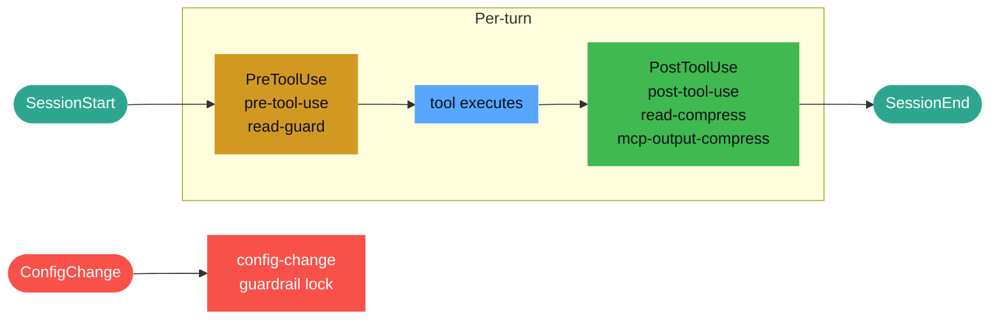

[repo]: https://github.com/johnzfitch/claude-warden
[hooks-docs]: https://docs.anthropic.com/en/docs/claude-code/hooks
[claude-code]: https://docs.anthropic.com/en/docs/claude-code
[token-api]: https://docs.anthropic.com/en/docs/build-with-claude/token-counting

[icon-shield]: .github/assets/icons/shield-security-protection-16x16.png
[icon-lock]: .github/assets/icons/lock-16x16.png
[icon-terminal]: .github/assets/icons/application-terminal-16x16.png
[icon-chart]: .github/assets/icons/chart-16x16.png
[icon-alert]: .github/assets/icons/alert-16x16.png
[icon-lightning]: .github/assets/icons/lightning-16x16.png
[icon-monitor]: .github/assets/icons/application-monitor-16x16.png
[icon-folder]: .github/assets/icons/blue-folder-16x16.png
[icon-stack]: .github/assets/icons/applications-stack-16x16.png
[icon-wrench]: .github/assets/icons/wrench-16x16.png
[icon-clock]: .github/assets/icons/alarm-clock-16x16.png
[icon-cross]: .github/assets/icons/cross-16x16.png
[icon-run]: .github/assets/icons/application-run-16x16.png
[icon-book]: .github/assets/icons/blue-document-view-book-16x16.png
[icon-key]: .github/assets/icons/blue-key-16x16.png
[icon-network]: .github/assets/icons/building-network-16x16.png
[icon-flow]: .github/assets/icons/application-network-16x16.png
[icon-metrics]: .github/assets/icons/chart-arrow-16x16.png
[badge-version]: https://img.shields.io/badge/version-v0.6.1-blue
[badge-license]: https://img.shields.io/badge/license-MIT-green
[badge-platform]: https://img.shields.io/badge/platform-Linux%20%7C%20macOS%20%7C%20WSL-lightgrey
[releases]: https://github.com/johnzfitch/claude-warden/releases
[license-file]: https://github.com/johnzfitch/claude-warden/blob/master/LICENSE

# claude-warden

[![version][badge-version]][releases] [![license][badge-license]][license-file] [![platform][badge-platform]][repo]

<ruby>claude-warden<rp>(</rp><rt>token guardian</rt><rp>)</rp></ruby> is a hook system for [Claude Code][claude-code] that intercepts every tool call before and after execution. It silences verbose commands, compresses large outputs, blocks unsafe network calls, enforces subagent budgets, and surfaces a live statusline &mdash; saving <mark>tens of thousands of tokens per session</mark> with negligible added latency.

## ![lightning][icon-lightning] Quickstart

1. Install prerequisites: `jq` (required). Optional: `rg`, `fd`.
2. Install hooks into `~/.claude/` (symlink mode):
   ```bash
   ./install.sh
   ```
3. Choose a profile when prompted (or pass `--profile standard`).
4. Start a new Claude Code session. Hooks run automatically.

> [!TIP]
> Run `./install.sh --dry-run` first to preview every change before anything touches `~/.claude/`.

```bash
./install.sh --dry-run
```

## ![monitor][icon-monitor] Demo Assets

Source demos live in [`demo/README.md`](demo/README.md). The repo includes VHS tapes for the main product walkthrough and the installer walkthrough, plus helper scripts for deterministic rendering.

<details>
<summary>More animations &mdash; TokenSavings, HookPipeline, WardenSystemOverview</summary>

<figure>
  
  <figcaption>Token savings counter &mdash; cumulative tokens saved as hooks intercept tool calls.</figcaption>
</figure>

<figure>
  
  <figcaption>Hook pipeline &mdash; tool calls flowing through the pre/post enforcement chain.</figcaption>
</figure>

<figure>
  
  <figcaption>System overview &mdash; orbital camera pass over the full three-layer architecture.</figcaption>
</figure>

</details>

## ![stack][icon-stack] Architecture

<figure>
  <picture>
    <source media="(prefers-color-scheme: dark)" srcset="assets/architecture-dark.png">
    <source media="(prefers-color-scheme: light)" srcset="assets/architecture-light.png">
    
  </picture>
  <figcaption>Three-layer architecture: <strong>Claude Code</strong> tool calls pass through the <strong>Hook Membrane</strong> (bash enforcement) into the <strong>warden-collector</strong> Go backbone, which stores spans in <abbr title="Write-Ahead Log">WAL</abbr>-mode SQLite and enforces subagent budgets via sub-millisecond <code>stat()</code> checks. Native <abbr title="OpenTelemetry Protocol">OTLP</abbr> telemetry flows directly from Claude Code to the collector on <code>:4319</code>.</figcaption>
</figure>

<figure>
  
  <figcaption>Token savings pipeline &mdash; tool calls enter the hook membrane, get silenced/compressed/blocked, and exit with dramatically fewer tokens.</figcaption>
</figure>

## ![shield][icon-shield] What it does

claude-warden installs a set of shell hooks that intercept Claude Code tool calls at every stage of execution. Each hook enforces token-efficient patterns and blocks common waste.


### Guard catalog

<details>
<summary>Full guard catalog &mdash; 15 hooks</summary>

| Hook | Event | What it guards |
|---|---|---|
| `pre-tool-use` | PreToolUse | <strong>Quiet overrides</strong>: injects quiet flags (<code>-q</code>, <code>--silent</code>, <code>-nostats</code>) into verbose commands (<code>git</code>, <code>npm</code>, <code>cargo</code>, <code>make</code>, <code>pip</code>, <code>wget</code>, <code>docker</code>, <code>ffmpeg</code>) via <code>updatedInput</code> instead of blocking. <strong>Network security</strong>: blocks <abbr title="Server-Side Request Forgery">SSRF</abbr> to metadata endpoints, localhost, and <abbr title="RFC 1918">private networks</abbr> (via <code>curl</code>/<code>wget</code>, WebFetch, WebSearch). Blocks data exfiltration (<code>curl</code> POST/upload flags). Blocks raw sockets (<code>nc</code>/<code>ncat</code>/<code>socat</code>) and network scanners (<code>nmap</code>/<code>masscan</code>). <strong>Environment safety</strong>: blocks full env dumps (<code>env</code>, <code>printenv</code>, <code>/proc/*/environ</code>); allows filtered forms. <strong>Sandbox</strong>: blocks Write/Edit/Bash writes to <code>.claude/settings</code> and <code>.claude/hooks</code>. <strong>Token guards</strong>: blocks binary reads, recursive grep/find without limits, oversized Write/Edit/NotebookEdit, minified file access, unbounded <code>git&nbsp;log</code>. Enforces subagent budgets. |
| `post-tool-use` | PostToolUse | Emits quiet-override <code>additionalContext</code> reminders so the model learns to include flags. Strips <code>&lt;system-reminder&gt;</code> blocks. Compresses Task output &gt;6KB to structured lines. Truncates Bash output &gt;20KB to 10KB. Suppresses output &gt;500KB. Detects binary output via <abbr title="POSIX octal dump">od</abbr>. Strips git hint/clone noise. Tracks session stats. Budget alerts at 75%/90%. |
| `mcp-output-compress` | PostToolUse (<code>mcp__*</code>) | Intercepts <abbr title="Model Context Protocol">MCP</abbr> tool output &gt;10.5&nbsp;KB (~3&thinsp;000 tokens). Strips noise fields (<code>chunk_id</code>, <code>score</code>, <code>embedding</code>, <code>vector</code>, 64-char hex hashes) recursively. When still over threshold, offloads full payload to <samp>/tmp/claude-mcp-output/</samp> and replaces with a compact summary + file path. Teaches the model via <code>additionalContext</code> to use <code>limit&le;5</code> / <code>max_tokens&le;4000</code> on repeat calls. |
| `read-guard` | PreToolUse (Read) | Blocks reads on bundled/generated files (<code>node_modules/</code>, <code>/dist/</code>, <code>.min.js</code>). Blocks files exceeding size limit (configurable, default 2MB). |
| `read-compress` | PostToolUse (Read) | Strips <code>&lt;system-reminder&gt;</code> blocks. Extracts structural signatures (imports, functions, classes) from large reads. Subagents: &gt;300 lines. Main agent: &gt;500 lines. |
| `permission-request` | PermissionRequest | Auto-denies dangerous commands (<code>rm&nbsp;-rf&nbsp;/</code>, <code>mkfs</code>, <code>curl&nbsp;\|&nbsp;bash</code>). Auto-allows safe read-only commands. |
| `config-change` | ConfigChange | Blocks <code>disableAllHooks</code> and unauthorized hook modifications from non-user sources. Prevents the model from disabling its own guardrails via settings writes. |
| `stop` | Stop | Logs session stop events with duration. |
| `session-start` | SessionStart | Initializes session timing, budget snapshots, and <code>events.jsonl</code> session markers. |
| `session-end` | SessionEnd | Logs duration, budget delta, subagent counts. Emits root <abbr title="OpenTelemetry Protocol">OTLP</abbr> trace span. Cleans up orphaned subagent state. |
| `subagent-start` | SubagentStart | Enforces budget limits. Tracks active subagent count (with cross-process locking). Injects type-specific guidance with output budgets. |
| `subagent-stop` | SubagentStop | Reclaims budget. Logs subagent metrics (duration, type, worktree). |
| `tool-error` | PostToolUseFailure | Logs errors with context. Provides recovery hints. |
| `pre-compact` | PreCompact | Injects warden context into compaction summaries. |
| `statusline.sh` | StatusLine | Model, context&nbsp;%, IO tokens, cache stats, tool count, hottest output, active subagents, budget utilization. |

</details>

### Hook lifecycle


```mermaid
flowchart LR
    SS([SessionStart]) --> PTU
    subgraph turn ["Per-turn"]
        direction LR
        PTU[PreToolUse\npre-tool-use\nread-guard] --> EX[[tool executes]]
        EX --> POTU[PostToolUse\npost-tool-use\nread-compress\nmcp-output-compress]
    end
    POTU --> SE([SessionEnd])
    CC([ConfigChange]) --> CCH[config-change\nguardrail lock]

    style SS fill:#2ea68f,color:#fff,stroke:none
    style SE fill:#2ea68f,color:#fff,stroke:none
    style PTU fill:#d29922,color:#0d1117,stroke:none
    style EX  fill:#58a6ff,color:#0d1117,stroke:none
    style POTU fill:#3fb950,color:#0d1117,stroke:none
    style CC  fill:#f85149,color:#fff,stroke:none
    style CCH fill:#f85149,color:#fff,stroke:none
```

<figure>
  
  <figcaption>A single tool call enters the hook membrane, gets evaluated against guard rules, and exits with a decision.</figcaption>
</figure>

## ![wrench][icon-wrench] Requirements

<dl>
  <dt><strong>Required</strong></dt>
  <dd><code>jq</code> &mdash; JSON processing</dd>
  <dd><code>Go 1.23+</code> &mdash; builds the warden-collector binary</dd>
  <dt><strong>Recommended</strong></dt>
  <dd><code>rg</code> (ripgrep), <code>fd</code> (fd-find)</dd>
  <dt><strong>Optional</strong></dt>
  <dd><code>python3</code> &mdash; warden-viewer web UI</dd>
  <dd><code>mitmdump</code> &mdash; only for the <a href="#flow-api-capture">API capture</a> tool</dd>
</dl>

## ![run][icon-run] Install

### Quick install (latest release)

```bash
curl -fsSL https://raw.githubusercontent.com/johnzfitch/claude-warden/master/install-remote.sh | bash
```

The remote installer downloads a release tarball, verifies its <abbr title="Secure Hash Algorithm 256-bit">SHA-256</abbr> checksum (hard-fails if missing), validates tarball contents, then runs `install.sh --copy`.

To pin a version:

```bash
curl -fsSL https://raw.githubusercontent.com/johnzfitch/claude-warden/master/install-remote.sh | bash -s -- v0.6.1
```

<details>
<summary>Install from source (development)</summary>

```bash
git clone https://github.com/johnzfitch/claude-warden.git ~/dev/claude-warden
cd ~/dev/claude-warden
./install.sh
```

</details>

### ![key][icon-key] Profiles

The installer applies a configuration profile that sets token limits, tool permissions, and internal thresholds. Choose one during install or pass `--profile`:

| Profile | What it sets |
|---|---|
| `minimal` | Hooks only. No env or permission changes. For users who manage `settings.json` themselves. |
| `standard` | Token/output limits, <abbr title="OpenTelemetry">OTEL</abbr> monitoring, 40 safe tool permissions (read-only git, search, inspection). <mark><strong>Recommended.</strong></mark> |
| `strict` | ~40% tighter limits across the board. Fewer pre-approved tools (19). Lower subagent budgets. |

```bash
./install.sh --profile standard
```

Profiles live in `config/profiles/`. Create `config/user.json` (gitignored) for personal overrides:

```bash
cp config/user.json.template config/user.json
# Edit config/user.json, then re-install:
./install.sh --profile standard
```

Merge order: `config/defaults.json` &larr; profile &larr; `config/user.json` &larr; existing `settings.json` (non-warden keys preserved).

<details>
<summary>Install modes &amp; what install.sh does</summary>

<dl>
  <dt><strong>Symlink</strong> (default)</dt>
  <dd>Edits to the repo take effect immediately. <code>./install.sh</code></dd>
  <dt><strong>Copy</strong></dt>
  <dd>Files are independent of the repo. <code>./install.sh --copy</code></dd>
  <dt><strong>Dry run</strong></dt>
  <dd>See what would happen without writing anything. <code>./install.sh --dry-run</code></dd>
</dl>

**What install.sh does**

<dl>
  <dt><strong>Detect &amp; prepare</strong></dt>
  <dd>Checks prerequisites (<code>jq</code> required, warns if <code>rg</code>/<code>fd</code> missing). Detects platform (Linux, macOS, <abbr title="Windows Subsystem for Linux">WSL</abbr>). Backs up existing hooks and <code>settings.json</code>.</dd>
  <dt><strong>Build configuration</strong></dt>
  <dd>Prompts for a profile (or uses <code>--profile</code>). Deep-merges <code>defaults.json</code> + profile + <code>user.json</code>.</dd>
  <dt><strong>Install hooks</strong></dt>
  <dd>Symlinks (or copies) hook scripts + <code>lib/</code> + <code>statusline.sh</code> into <code>~/.claude/</code>. Sets executable permissions.</dd>
  <dt><strong>Build collector</strong></dt>
  <dd>Compiles the Go collector (<code>warden-collector</code>) and installs it to <code>~/.local/bin/</code>. The collector starts automatically on <code>session-start</code> and provides SQLite-backed session tracking, subagent budget enforcement, and an <abbr title="OpenTelemetry Protocol">OTLP</abbr> span receiver.</dd>
  <dt><strong>Apply configuration</strong></dt>
  <dd>Generates <code>~/.claude/.warden/warden.env</code> (hook thresholds). Merges env vars and permissions into <code>settings.json</code> (union for permissions, preserves plugins/model/etc). Generates <code>warden.env.sh</code> for shell sourcing.</dd>
  <dt><strong>Validate</strong></dt>
  <dd>Checks JSON validity and shell syntax for every installed script.</dd>
</dl>

</details>

## ![cross][icon-cross] Uninstall

```bash
./uninstall.sh
```

Restores your most recent `settings.json` backup. Removes `~/.claude/.warden/` config. Hook backups remain in `~/.claude/hooks.bak.*/`.

## ![wrench][icon-wrench] Configuration

### ![metrics][icon-metrics] Tuning thresholds

All thresholds are configurable via `config/defaults.json`, profiles, or `config/user.json`. After editing, re-run `./install.sh` to regenerate `~/.claude/.warden/warden.env`.

| Threshold | Config key | Default | Strict |
|---|---|---|---|
| Output truncation | `warden.truncate_bytes` | 20KB | 10KB |
| Subagent read cap | `warden.subagent_read_bytes` | 10KB | 6KB |
| Output suppression | `warden.suppress_bytes` | 512KB | 256KB |
| Read file size limit | `warden.read_guard_max_mb` | 2MB | 1MB |
| Write max size | `warden.write_max_bytes` | 100KB | 50KB |
| Edit max size | `warden.edit_max_bytes` | 50KB | 25KB |
| Subagent call limits | `warden.subagent_call_limits.*` | 15&ndash;40 | 10&ndash;25 |
| Subagent byte limits | `warden.subagent_byte_limits.*` | 80&ndash;150KB | 50&ndash;100KB |

Token limits and tool permissions are set in the `env` and `permissions` sections of the config files and merged into `settings.json` during install.

- **Read compression**: `read-compress` &mdash; subagent threshold at 300 lines, main agent at 500 lines
- **Binary detection**: `post-tool-use` &mdash; POSIX `od` + `grep` for <abbr title="null byte">NUL</abbr> bytes (full-stream scan)

<details>
<summary>Shell environment, token accounting, disabling guards, custom allow-list</summary>

**Shell environment**

Add to `~/.zshrc` or `~/.bashrc`:

```bash
# claude-warden env
source "$HOME/.claude/.warden/warden.env.sh"
```

This exports <abbr title="OpenTelemetry">OTEL</abbr>, token limit, timeout, and sandbox vars from your chosen profile into every new shell. Re-running `install.sh` regenerates it.

**Token savings accounting**

All hooks report savings to `~/.claude/.statusline/events.jsonl` at ~3.5&nbsp;bytes/token (estimated). For exact counts:

```bash
export WARDEN_TOKEN_COUNT=api
```

Each truncation event spawns a background call to the [Anthropic token counting API][token-api] (free, separate rate limits) and appends a correction event. Zero added latency.

<dl>
  <dt>Requirements for API mode</dt>
  <dd><code>ANTHROPIC_API_KEY</code> in environment; <code>python3</code> with <code>anthropic</code> installed</dd>
  <dt>Custom Python path</dt>
  <dd>Set <code>WARDEN_PYTHON=/path/to/venv/bin/python3</code> if needed</dd>
  <dt>Graceful degradation</dt>
  <dd>Missing key, missing package, or network failure &rarr; silently exits, estimate stands</dd>
</dl>

**Disabling specific guards**

Remove the corresponding matcher from `settings.hooks.json` and re-run `./install.sh`. Example &mdash; disable read compression:

```json
{
  "matcher": "Read",
  "hooks": [{"type": "command", "command": "$HOME/.claude/hooks/read-compress", "timeout": 7}]
}
```

**Adding your own permission allow-list**

```bash
cp config/user.json.template config/user.json
```

```json
{
  "permissions": {
    "allow": ["Bash(gh api:*)", "Bash(pacman -Q:*)", "mcp__filesystem__list_directory"]
  }
}
```

Re-run `./install.sh` to merge. User permissions are unioned with profile permissions &mdash; nothing is removed.

</details>

## ![network][icon-network] Platform support

| Platform | Status | Notes |
|---|---|---|
| Linux | Full support | Primary development platform |
| macOS | Full support | Uses `gtimeout` fallback, `osascript` for notifications, macOS `stat` flags |
| <abbr title="Windows Subsystem for Linux">WSL</abbr> | Full support | Detected via `/proc/version` |

<details>
<summary>Cross-platform details</summary>

- **`timeout`**: Falls back to `gtimeout` (coreutils), then no-timeout
- **`stat`**: Uses `-c%s` (Linux) with `-f%z` (macOS) fallback
- **`flock`**: Replaced with `mkdir`-based locking (atomic on all POSIX)
- **`notify-send`**: Falls back to `osascript` (macOS), silently skips if neither available
- **`rg`**: Falls back to `grep` where used
- **Binary detection**: Uses `od -An -tx1 | grep ' 00'` (POSIX, works on macOS/Linux/BSD)

</details>

## ![stack][icon-stack] Go Collector

The **warden-collector** is a lightweight Go service that acts as the central backbone for all observation and state. It starts automatically when a Claude Code session begins (via the `session-start` hook) and stops when idle.

<details>
<summary>Collector internals, data storage &amp; viewer</summary>

<dl>
  <dt><strong>Session tracking</strong></dt>
  <dd>Stores per-session token counts, model info, context window size, and estimated context utilization in SQLite (WAL mode).</dd>
  <dt><strong><abbr title="OpenTelemetry Protocol">OTLP</abbr> span receiver</strong></dt>
  <dd>Listens on <code>:4319</code> for HTTP/JSON traces from Claude Code. Extracts <code>llm_request</code> spans to populate session token data (input, output, cache read/create).</dd>
  <dt><strong>Subagent budget enforcement</strong></dt>
  <dd>Tracks per-agent call counts and byte totals. When a budget is exceeded, writes a deny file (<code>budget-deny-{agent_id}</code>) that <code>pre-tool-use</code> checks via sub-millisecond <code>stat</code>.</dd>
  <dt><strong>Hook event ingestion</strong></dt>
  <dd>Accepts hook events via <code>POST /v1/ingest/hook</code> over a Unix domain socket (<code>collector.sock</code>). All hooks post events here instead of managing local state files.</dd>
  <dt><strong>Query <abbr title="Application Programming Interface">API</abbr></strong></dt>
  <dd><code>GET /v1/sessions</code> lists sessions. <code>GET /v1/sessions/{id}/context</code> returns token counts, context percentage, and compact threshold. The statusline queries this endpoint.</dd>
</dl>

**Data storage** &mdash; `${XDG_STATE_HOME:-~/.local/state}/claude-warden/`:

| File | Purpose |
|---|---|
| `collector.db` | SQLite database (sessions, hook events, subagent budgets, OTLP spans) |
| `collector.sock` | Unix domain socket for hook &rarr; collector communication |
| `collector.pid` | PID file for lifecycle management |
| `budget-deny-*` | Deny files written when subagent budgets are exceeded |

**Viewer** &mdash; optional htmx web UI on port 8477 (context gauge, request waterfall, event log, cost tracking, tool breakdown, token trend):

```bash
python3 viewer/warden-viewer.py
```

</details>

## ![monitor][icon-monitor] Monitoring stack (optional)

Warden includes an optional Docker-based observability stack in `monitoring/` for persistent log aggregation, metrics, and distributed tracing. This supplements the Go collector with long-term storage and Grafana dashboards.

> [!NOTE]
> The Go collector is the primary observability backbone and is always installed. The Docker monitoring stack is optional and provides additional visualization via Grafana, long-term log storage via Loki, and distributed tracing via Tempo.

<details>
<summary>Components, setup, data flow, dashboards</summary>

| Service | Image | Port | Purpose |
|---|---|---|---|
| Loki | `grafana/loki:3.4.2` | 3100 | Log aggregation (30-day retention, <abbr title="Time Series Database">TSDB</abbr> storage) |
| <abbr title="OpenTelemetry">OTEL</abbr> Collector | `otel/opentelemetry-collector-contrib` | 4317/4318 | Receives <abbr title="OpenTelemetry Protocol">OTLP</abbr> logs + traces, tails `events.jsonl`, exports to Loki + Tempo |
| Prometheus | `prom/prometheus` | 9090 | Metrics (<abbr title="OpenTelemetry Protocol">OTLP</abbr> + warden textfile fallbacks) |
| Node Exporter | `prom/node-exporter` | 9101 | Textfile collector for budget and session metrics |
| Tempo | `grafana/tempo:2.7.2` | 3200/3205 | Distributed trace storage and visualization |
| Grafana | `grafana/grafana` | 3000 | Dashboards (<samp>admin</samp>/<samp>admin</samp>) |

**Start** (Linux):

```bash
cd monitoring && docker compose up -d
```

**macOS / Docker Desktop**:

```bash
cd monitoring && docker compose -f docker-compose.yml -f docker-compose.macos.yml up -d
```

**Dashboards** &mdash; four provisioned in `monitoring/grafana/dashboards/`: cost/tokens/budget (`claude-code-otel`), tool latency/traces (`warden-tool-latency`), output size/tokens (`warden-output-size`), subagent/session lifecycle (`warden-subagent-lifecycle`).

**Verification**:

```bash
curl -s http://localhost:3100/ready   # Loki
curl -s http://localhost:3200/ready   # Tempo
grep tool_latency ~/.claude/.statusline/events.jsonl | tail -5
```

</details>

<details>
<summary>![flow][icon-flow] API capture</summary>

The `capture/` directory contains a <abbr title="man-in-the-middle">MITM</abbr> proxy wrapper for recording full Claude Code API traffic.

```bash
capture/claude                          # interactive session
capture/claude -p "prompt"             # non-interactive
```

Logs land in <samp>~/claude-captures/YYYY-MM-DD/capture-HHMMSS.jsonl</samp>. Each line is a JSON record: `stream_start`, `stream_chunk`, `stream_end` (for <abbr title="Server-Sent Events">SSE</abbr>), or `exchange` (for non-streaming).

> [!IMPORTANT]
> Request and response bodies are **truncated to 200 characters by default**. To enable full body capture, set `WARDEN_CAPTURE_BODIES=1`. Even with full capture enabled, sensitive JSON keys (`system`, `messages`) are redacted.

<dl>
  <dt>Prerequisites</dt>
  <dd><code>mitmdump</code> (from <code>mitmproxy</code>) and a trusted CA cert at <code>~/.mitmproxy/mitmproxy-ca-cert.pem</code></dd>
  <dt>Log permissions</dt>
  <dd>Capture JSONL files and the proxy log (<code>~/.claude/capture-mitm.log</code>) are created with mode <code>600</code></dd>
  <dt>Header scrubbing</dt>
  <dd><code>x-api-key</code>, <code>authorization</code>, and <code>proxy-authorization</code> headers are redacted in both streaming and non-streaming paths</dd>
</dl>

</details>

<details>
<summary>![folder][icon-folder] Project layout</summary>

| Path | Purpose |
|---|---|
| `hooks/` | Claude Code hook scripts (bash) |
| `hooks/lib/common.sh` | Shared library: input parsing, event emission, latency tracking, cross-platform shims |
| `hooks/lib/otel-trace.sh` | Lightweight <abbr title="OpenTelemetry Protocol over HTTP">OTLP/HTTP</abbr> trace span emitter (bash + curl) |
| `config/defaults.json` | Baseline warden config: <abbr title="OpenTelemetry">OTEL</abbr>, thresholds, subagent budgets |
| `config/profiles/` | Named configuration profiles (`minimal`, `standard`, `strict`) |
| `config/user.json.template` | Template for user overrides (copy to `config/user.json`) |
| `collector/` | Go collector: SQLite store, OTLP receiver, hook event API, budget enforcement |
| `viewer/` | htmx web UI for viewing collector data (sessions, tokens, events) |
| `capture/` | <abbr title="man-in-the-middle">MITM</abbr> proxy wrapper + mitmproxy addon for API traffic capture |
| `statusline.sh` | Claude Code statusline script (bash) |
| `settings.hooks.json` | Hook + statusline config template merged into `~/.claude/settings.json` |
| `install.sh` | Installs hooks, merges config profile into `settings.json`, generates `warden.env` |
| `install-remote.sh` | Downloads a release tarball, verifies checksum, runs `install.sh --copy` |
| `uninstall.sh` | Removes hooks/statusline/config and restores the most recent settings backup |
| `monitoring/` | Optional Docker Compose observability stack (Loki, <abbr title="OpenTelemetry">OTEL</abbr> Collector, Prometheus, Tempo, Grafana) |
| `monitoring/docker-compose.macos.yml` | Bridge networking override for Docker Desktop (macOS/Windows) |
| `monitoring/grafana/` | Grafana provisioning (datasources, dashboards) |
| `tests/` | Fixture-driven test harness (`bash tests/run.sh`) |
| `.github/` | Issue templates (<abbr title="YAML Ain't Markup Language">YAML</abbr> forms), <abbr title="Pull Request">PR</abbr> template, community health files |
| `CITATION.cff` | Repository citation metadata (enables &ldquo;Cite this repository&rdquo; on GitHub) |
| `VERSION` | Current release version |
| `assets/` | README images (architecture diagram) |
| `demo/mock-inputs/` | Small JSON fixtures for exercising hooks locally |

</details>

## ![book][icon-book] How it works

Claude Code supports [hooks][hooks-docs] &mdash; shell commands that run at specific points in the tool-use lifecycle. Hooks receive JSON on stdin describing the tool call and can:

- **Exit 0**: Allow the tool call (optionally with `{"suppressOutput":true}`)
- **Exit 2**: Block the tool call (stderr message is fed back to Claude as feedback)
- **Output JSON**: Modify tool output (`{"modifyOutput":"..."}`) or suppress it

claude-warden hooks are pure bash with a single dependency (`jq`). They run in milliseconds and add negligible latency to tool calls. All paths use `$HOME` for portability &mdash; no hardcoded user directories. Every filtering decision (block, truncate, compress, strip) is logged to `~/.claude/.statusline/events.jsonl` with token savings estimates for downstream consumers.

## ![run][icon-run] Testing

Run the test harness:

```bash
bash tests/run.sh
```

It runs shell syntax checks, validates JSON fixtures, and executes fixture-driven behavioral assertions covering pre-tool-use blocking/allow, post-tool-use output tracking/truncation, read-compress, permission-request, and statusline rendering.

<details>
<summary>Manual checks</summary>

```bash
# Shell syntax
find hooks -maxdepth 1 -type f -print0 | xargs -0 bash -n
bash -n install.sh uninstall.sh statusline.sh

# JSON validity
jq . settings.hooks.json config/defaults.json config/profiles/*.json >/dev/null

# Exercise post-tool-use fixture (system reminder stripping)
cat demo/mock-inputs/post-tool-use-reminder-bash.json | hooks/post-tool-use | jq -r '.modifyOutput'
```

</details>

## ![alert][icon-alert] Troubleshooting

<details>
<summary>Hooks don&rsquo;t seem to run</summary>

1. Confirm <code>~/.claude/settings.json</code> contains the <code>hooks</code> key (install merges <code>settings.hooks.json</code> into it).
2. Start a <strong>fresh</strong> Claude Code session &mdash; hooks load at startup, not mid-session.
3. If a command appears in your <code>permissions.allow</code> list, it bypasses the <code>permission-request</code> hook entirely.

> [!NOTE]
> Run `jq '.hooks | keys' ~/.claude/settings.json` to verify the hook keys are present.

</details>

<details>
<summary>Read is being blocked unexpectedly</summary>

`read-guard` blocks common bundled/generated patterns (`node_modules/`, `dist/`, minified JS) and blocks files larger than the configured limit (default 2MB, configurable via `warden.read_guard_max_mb`). Search for the original source file or use a bounded read (smaller slices).

</details>

<details>
<summary>macOS Docker Desktop networking issues</summary>

The base `docker-compose.yml` uses `network_mode: host`, which Docker Desktop does not support. Use the macOS override:

```bash
docker compose -f docker-compose.yml -f docker-compose.macos.yml up -d
```

This switches to bridge networking and mounts config files that replace `localhost` with Docker service <abbr title="Domain Name System">DNS</abbr> names.

</details>

<details>
<summary>Hooks don&rsquo;t run in a specific project directory</summary>

Claude Code gates hook execution on <em>workspace trust</em>. A workspace is trusted once its project-level `CLAUDE.md` has been accepted at launch. Until then, all hooks are skipped &mdash; including those defined globally in `~/.claude/settings.json`. Symptom in the debug log (<samp>~/.claude/debug/&lt;session-id&gt;.txt</samp>):

```
Skipping PreToolUse:Bash hook execution - workspace trust not accepted
```

**Fix**: create a `CLAUDE.md` in the project root (contents can be a single comment). Claude Code will prompt you to accept it on the next session start &mdash; press <kbd>Enter</kbd> to trust it. Once accepted, all hooks fire normally.

> [!NOTE]
> This is a Claude Code behavior, not a warden limitation. Even user-global hooks in `~/.claude/settings.json` are gated by per-workspace trust.

</details>

## Contributing

See `CONTRIBUTING.md`.

## ![lock][icon-lock] Security

See `SECURITY.md` for security assumptions, data handling notes, and reporting guidance.

## License

MIT
