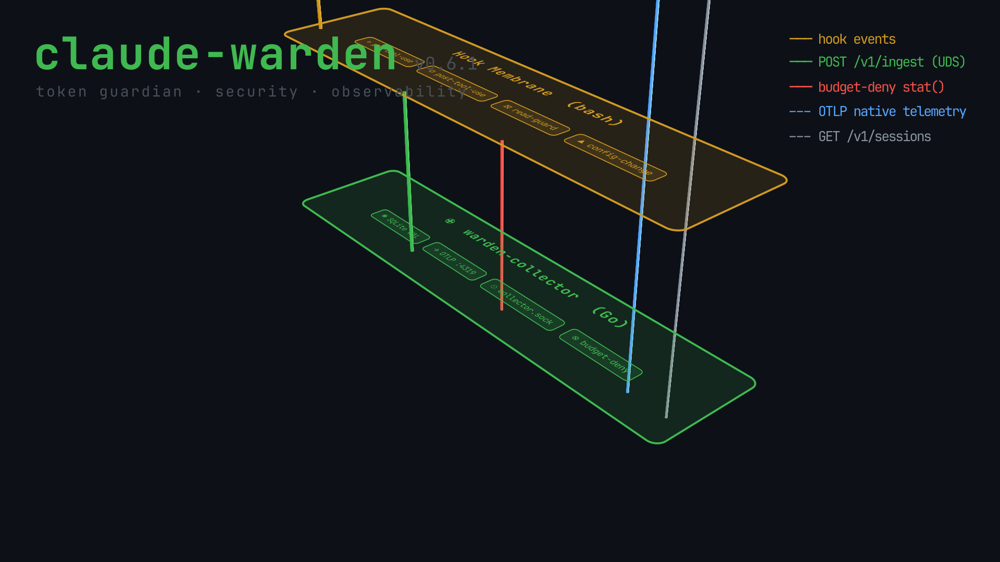

[repo]: https://github.com/johnzfitch/claude-warden
[hooks-docs]: https://docs.anthropic.com/en/docs/claude-code/hooks
[claude-code]: https://docs.anthropic.com/en/docs/claude-code
[token-api]: https://docs.anthropic.com/en/docs/build-with-claude/token-counting

[badge-version]: https://img.shields.io/badge/version-v0.6.1-blue
[badge-license]: https://img.shields.io/badge/license-MIT-green
[badge-platform]: https://img.shields.io/badge/platform-Linux%20%7C%20macOS%20%7C%20WSL-lightgrey
[releases]: https://github.com/johnzfitch/claude-warden/releases
[license-file]: https://github.com/johnzfitch/claude-warden/blob/master/LICENSE

# claude-warden

[![version][badge-version]][releases] [![license][badge-license]][license-file] [![platform][badge-platform]][repo]

<ruby>claude-warden<rp>(</rp><rt>token guardian</rt><rp>)</rp></ruby> is a hook system for [Claude Code][claude-code] that intercepts every tool call before and after execution. It silences verbose commands, compresses large outputs, blocks unsafe network calls, enforces subagent budgets, and surfaces a live statusline &mdash; saving <mark>tens of thousands of tokens per session</mark> with negligible added latency.

##  Quickstart

1. Install prerequisites: `jq` (required). Optional: `rg`, `fd`.
2. Install hooks into `~/.claude/` (symlink mode):
   ```bash
   ./install.sh
   ```
3. Choose a profile when prompted (or pass `--profile standard`).
4. Start a new Claude Code session. Hooks run automatically.

> [!TIP]
> Run `./install.sh --dry-run` first to preview every change before anything touches `~/.claude/`.

```bash
./install.sh --dry-run
```

##  What it does

claude-warden installs shell hooks that intercept every Claude Code tool call. Each hook enforces token-efficient patterns and blocks unsafe operations.

### Guard catalog


##  Architecture

<figure>
  
  <figcaption>Token savings pipeline &mdash; tool calls enter the hook membrane, get silenced/compressed/blocked, and exit with fewer tokens.</figcaption>
</figure>

<figure>
  <picture>
    <source media="(prefers-color-scheme: dark)" srcset="assets/architecture-dark.png">
    <source media="(prefers-color-scheme: light)" srcset="assets/architecture-light.png">
    
  </picture>
  <figcaption>Claude Code tool calls pass through the hook membrane (bash enforcement) into the warden-collector Go backbone, which stores spans in WAL-mode SQLite and enforces subagent budgets via sub-millisecond <code>stat()</code> checks.</figcaption>
</figure>

##  Requirements

| | Dependency | Purpose |
|:---|:---|:---|
| **Required** | `jq` | JSON processing |
| | `Go 1.23+` | Builds the warden-collector binary |
| **Recommended** | `rg`, `fd` | Faster search/find in hooks |
| **Optional** | `python3` | Warden-viewer web UI |
| | `mitmdump` | API capture tool only |

##  Install

### Quick install (latest release)

```bash
curl -fsSL https://raw.githubusercontent.com/johnzfitch/claude-warden/master/install-remote.sh | bash
```

Downloads a release tarball, verifies its SHA-256 checksum, validates contents, then runs `install.sh --copy`.

To pin a version:

```bash
curl -fsSL https://raw.githubusercontent.com/johnzfitch/claude-warden/master/install-remote.sh | bash -s -- v0.6.1
```

<details>
<summary>Install from source (development)</summary>

```bash
git clone https://github.com/johnzfitch/claude-warden.git ~/dev/claude-warden
cd ~/dev/claude-warden
./install.sh
```

</details>

###  Profiles

The installer applies a configuration profile that sets token limits, tool permissions, and internal thresholds. Choose one during install or pass `--profile`:

| Profile | What it sets |
|:---|:---|
| `minimal` | Hooks only. No env or permission changes. For users who manage `settings.json` themselves. |
| `standard` | Token/output limits, OTEL monitoring, 40 safe tool permissions. <mark><strong>Recommended.</strong></mark> |
| `strict` | ~40% tighter limits. Fewer pre-approved tools (19). Lower subagent budgets. |

```bash
./install.sh --profile standard
```

Profiles live in `config/profiles/`. Create `config/user.json` (gitignored) for personal overrides:

```bash
cp config/user.json.template config/user.json
# Edit config/user.json, then re-install:
./install.sh --profile standard
```

Merge order: `defaults.json` &larr; profile &larr; `user.json` &larr; existing `settings.json` (non-warden keys preserved).

<details>
<summary>Install modes &amp; what install.sh does</summary>

| Mode | Command | Behavior |
|:---|:---|:---|
| **Symlink** (default) | `./install.sh` | Edits to repo take effect immediately |
| **Copy** | `./install.sh --copy` | Files independent of repo |
| **Dry run** | `./install.sh --dry-run` | Preview changes, write nothing |

**What install.sh does:**
1. Checks prerequisites (`jq` required, warns if `rg`/`fd` missing). Detects platform. Backs up existing hooks and `settings.json`.
2. Prompts for a profile (or uses `--profile`). Deep-merges `defaults.json` + profile + `user.json`.
3. Symlinks (or copies) hook scripts + `lib/` + `statusline.sh` into `~/.claude/`.
4. Builds the Go collector and installs to `~/.local/bin/`.
5. Generates `warden.env` (thresholds). Merges env vars and permissions into `settings.json`.
6. Validates JSON and shell syntax for every installed script.

</details>

##  Uninstall

```bash
./uninstall.sh
```

Restores your most recent `settings.json` backup. Removes `~/.claude/.warden/` config. Hook backups remain in `~/.claude/hooks.bak.*/`.

##  Configuration

###  Tuning thresholds

All thresholds are configurable via `config/defaults.json`, profiles, or `config/user.json`. After editing, re-run `./install.sh` to regenerate `~/.claude/.warden/warden.env`.

| Threshold | Config key | Default | Strict |
|:---|:---|---:|---:|
| Output truncation | `warden.truncate_bytes` | 20KB | 10KB |
| Subagent read cap | `warden.subagent_read_bytes` | 10KB | 6KB |
| Output suppression | `warden.suppress_bytes` | 512KB | 256KB |
| Read file size limit | `warden.read_guard_max_mb` | 2MB | 1MB |
| Write max size | `warden.write_max_bytes` | 100KB | 50KB |
| Edit max size | `warden.edit_max_bytes` | 50KB | 25KB |
| Subagent call limits | `warden.subagent_call_limits.*` | 15&ndash;40 | 10&ndash;25 |
| Subagent byte limits | `warden.subagent_byte_limits.*` | 80&ndash;150KB | 50&ndash;100KB |

Token limits and tool permissions are set in the `env` and `permissions` sections of the config files and merged into `settings.json` during install.

- **Read compression**: <code>read-compress</code> &mdash; subagent threshold at 300 lines, main agent at 500 lines
- **Binary detection**: <code>post-tool-use</code> &mdash; POSIX <code>od</code> + <code>grep</code> for NUL bytes (full-stream scan)

<details>
<summary>Shell environment, token accounting, disabling guards, custom allow-list</summary>

**Shell environment**

Add to `~/.zshrc` or `~/.bashrc`:

```bash
# claude-warden env
source "$HOME/.claude/.warden/warden.env.sh"
```

Exports OTEL, token limit, timeout, and sandbox vars from your profile into every new shell.

**Token savings accounting**

All hooks report savings to `~/.claude/.statusline/events.jsonl` at ~3.5&nbsp;bytes/token (estimated). For exact counts:

```bash
export WARDEN_TOKEN_COUNT=api
```

Each truncation event spawns a background call to the [Anthropic token counting API][token-api] (free, separate rate limits) and appends a correction event. Zero added latency.

<dl>
  <dt>Requirements for API mode</dt>
  <dd><code>ANTHROPIC_API_KEY</code> in environment; <code>python3</code> with <code>anthropic</code> installed</dd>
  <dt>Custom Python path</dt>
  <dd>Set <code>WARDEN_PYTHON=/path/to/venv/bin/python3</code> if needed</dd>
  <dt>Graceful degradation</dt>
  <dd>Missing key, missing package, or network failure &rarr; silently exits, estimate stands</dd>
</dl>

**Disabling specific guards**

Remove the corresponding matcher from `settings.hooks.json` and re-run `./install.sh`. Example &mdash; disable read compression:

```json
{
  "matcher": "Read",
  "hooks": [{"type": "command", "command": "$HOME/.claude/hooks/read-compress", "timeout": 7}]
}
```

**Adding your own permission allow-list**

```bash
cp config/user.json.template config/user.json
```

```json
{
  "permissions": {
    "allow": ["Bash(gh api:*)", "Bash(pacman -Q:*)", "mcp__filesystem__list_directory"]
  }
}
```

Re-run `./install.sh` to merge. User permissions are unioned with profile permissions &mdash; nothing is removed.

</details>

##  Platform support

| Platform | Status | Notes |
|:---|:---|:---|
| Linux | Full support | Primary development platform |
| macOS | Full support | `gtimeout` fallback, `osascript` notifications, macOS `stat` flags |
| WSL | Full support | Detected via `/proc/version` |

<details>
<summary>Cross-platform details</summary>

- **`timeout`**: Falls back to `gtimeout` (coreutils), then no-timeout
- **`stat`**: Uses `-c%s` (Linux) with `-f%z` (macOS) fallback
- **`flock`**: Replaced with `mkdir`-based locking (atomic on all POSIX)
- **`notify-send`**: Falls back to `osascript` (macOS), silently skips if neither available
- **`rg`**: Falls back to `grep` where used
- **Binary detection**: Uses `od -An -tx1 | grep ' 00'` (POSIX, works on macOS/Linux/BSD)

</details>

##  Go Collector

The **warden-collector** is a Go service that provides session tracking, subagent budget enforcement, and OTLP span ingestion. It starts automatically on `session-start` and stops when idle.

<details>
<summary>Collector internals, data storage &amp; viewer</summary>

- **Session tracking** &mdash; per-session token counts, model info, context window in WAL-mode SQLite
- **OTLP receiver** &mdash; listens on `:4319` for traces from Claude Code, extracts `llm_request` spans
- **Subagent budgets** &mdash; tracks call counts and bytes; writes deny files checked by `pre-tool-use` via `stat()`
- **Hook events** &mdash; accepts events via `POST /v1/ingest/hook` over Unix domain socket
- **Query API** &mdash; `GET /v1/sessions`, `GET /v1/sessions/{id}/context` (used by statusline)

**Data storage** &mdash; `${XDG_STATE_HOME:-~/.local/state}/claude-warden/`:

| File | Purpose |
|:---|:---|
| `collector.db` | SQLite database (sessions, events, budgets, OTLP spans) |
| `collector.sock` | Unix domain socket for hook &rarr; collector communication |
| `collector.pid` | PID file for lifecycle management |
| `budget-deny-*` | Deny files written when subagent budgets are exceeded |

**Viewer** &mdash; optional htmx web UI on port 8477:

```bash
python3 viewer/warden-viewer.py
```

</details>

##  Monitoring stack (optional)

Optional Docker stack in `monitoring/` for log aggregation, metrics, and tracing. Supplements the Go collector with Grafana dashboards and long-term storage.

<details>
<summary>Components, setup, data flow, dashboards</summary>

| Service | Image | Port | Purpose |
|:---|:---|---:|:---|
| Loki | `grafana/loki:3.4.2` | 3100 | Log aggregation (30-day retention) |
| OTEL Collector | `otel/opentelemetry-collector-contrib` | 4317/4318 | OTLP logs + traces, tails `events.jsonl` |
| Prometheus | `prom/prometheus` | 9090 | Metrics |
| Node Exporter | `prom/node-exporter` | 9101 | Textfile collector for budget metrics |
| Tempo | `grafana/tempo:2.7.2` | 3200/3205 | Trace storage |
| Grafana | `grafana/grafana` | 3000 | Dashboards (`admin`/`admin`) |

**Start** (Linux):

```bash
cd monitoring && docker compose up -d
```

**macOS / Docker Desktop**:

```bash
cd monitoring && docker compose -f docker-compose.yml -f docker-compose.macos.yml up -d
```

**Dashboards** &mdash; four provisioned in `monitoring/grafana/dashboards/`: cost/tokens/budget (`claude-code-otel`), tool latency/traces (`warden-tool-latency`), output size/tokens (`warden-output-size`), subagent/session lifecycle (`warden-subagent-lifecycle`).

**Verification**:

```bash
curl -s http://localhost:3100/ready   # Loki
curl -s http://localhost:3200/ready   # Tempo
grep tool_latency ~/.claude/.statusline/events.jsonl | tail -5
```

</details>

<details>
<summary> API capture</summary>

MITM proxy wrapper in `capture/` for recording Claude Code API traffic.

```bash
capture/claude                          # interactive session
capture/claude -p "prompt"             # non-interactive
```

Logs land in `~/claude-captures/YYYY-MM-DD/capture-HHMMSS.jsonl`.

> [!IMPORTANT]
> Bodies are **truncated to 200 chars by default**. Set `WARDEN_CAPTURE_BODIES=1` for full capture. Sensitive keys (`system`, `messages`) are always redacted.

- **Requires**: `mitmdump` + trusted CA cert at `~/.mitmproxy/mitmproxy-ca-cert.pem`
- **Permissions**: JSONL files created with mode <kbd>600</kbd>
- **Scrubbing**: `x-api-key`, `authorization`, `proxy-authorization` headers redacted

</details>

<details>
<summary> Project layout</summary>

| Path | Purpose |
|:---|:---|
| `hooks/` | Hook scripts (bash) |
| `hooks/lib/common.sh` | Shared library: parsing, events, latency, cross-platform shims |
| `hooks/lib/otel-trace.sh` | OTLP/HTTP trace span emitter |
| `config/` | Defaults, profiles (`minimal`/`standard`/`strict`), user overrides |
| `collector/` | Go collector: SQLite, OTLP receiver, budget enforcement |
| `viewer/` | htmx web UI (sessions, tokens, events) |
| `capture/` | MITM proxy for API traffic capture |
| `statusline.sh` | Claude Code statusline script |
| `settings.hooks.json` | Hook config merged into `~/.claude/settings.json` |
| `install.sh` | Install hooks, merge config, generate `warden.env` |
| `uninstall.sh` | Remove hooks, restore settings backup |
| `monitoring/` | Optional Docker stack (Loki, OTEL Collector, Prometheus, Tempo, Grafana) |
| `tests/` | Fixture-driven test harness |

</details>

##  How it works

Claude Code supports [hooks][hooks-docs] &mdash; shell commands that run at specific points in the tool-use lifecycle. Hooks receive JSON on stdin describing the tool call and can:

- **Exit 0**: Allow the tool call (optionally with `{"suppressOutput":true}`)
- **Exit 2**: Block the tool call (stderr message is fed back to Claude as feedback)
- **Output JSON**: Modify tool output (`{"modifyOutput":"..."}`) or suppress it

Hooks are pure bash with a single dependency (`jq`). They run in milliseconds. All paths use `$HOME` for portability. Every decision (block, truncate, compress, strip) is logged to `events.jsonl` with token savings estimates.

##  Testing

Run the test harness:

```bash
bash tests/run.sh
```

It runs shell syntax checks, validates JSON fixtures, and executes fixture-driven behavioral assertions covering pre-tool-use blocking/allow, post-tool-use output tracking/truncation, read-compress, permission-request, and statusline rendering.

<details>
<summary>Manual checks</summary>

```bash
# Shell syntax
find hooks -maxdepth 1 -type f -print0 | xargs -0 bash -n
bash -n install.sh uninstall.sh statusline.sh

# JSON validity
jq . settings.hooks.json config/defaults.json config/profiles/*.json >/dev/null

# Exercise post-tool-use fixture (system reminder stripping)
cat demo/mock-inputs/post-tool-use-reminder-bash.json | hooks/post-tool-use | jq -r '.modifyOutput'
```

</details>

##  Troubleshooting

<details>
<summary>Hooks don't seem to run</summary>

1. Confirm `~/.claude/settings.json` contains the `hooks` key: `jq '.hooks | keys' ~/.claude/settings.json`
2. Start a **fresh** session &mdash; hooks load at startup, not mid-session.
3. Commands in `permissions.allow` bypass the `permission-request` hook entirely.

</details>

<details>
<summary>Read is being blocked unexpectedly</summary>

`read-guard` blocks bundled/generated patterns (`node_modules/`, `dist/`, minified JS) and files larger than 2MB (configurable via `warden.read_guard_max_mb`). Use bounded reads or find the source file.

</details>

<details>
<summary>macOS Docker Desktop networking issues</summary>

The base `docker-compose.yml` uses `network_mode: host`, which Docker Desktop does not support. Use the macOS override:

```bash
docker compose -f docker-compose.yml -f docker-compose.macos.yml up -d
```

This switches to bridge networking and replaces `localhost` with Docker service DNS names.

</details>

<details>
<summary>Hooks don't run in a specific project directory</summary>

Claude Code gates hooks on workspace trust. Until the project's `CLAUDE.md` is accepted at launch, all hooks are skipped. Symptom:

```
Skipping PreToolUse:Bash hook execution - workspace trust not accepted
```

**Fix**: create a `CLAUDE.md` in the project root. Press <kbd>Enter</kbd> to accept it on next session start.

</details>

## Contributing

See `CONTRIBUTING.md`.

##  Security

See `SECURITY.md` for security assumptions, data handling notes, and reporting guidance.

## License

MIT
